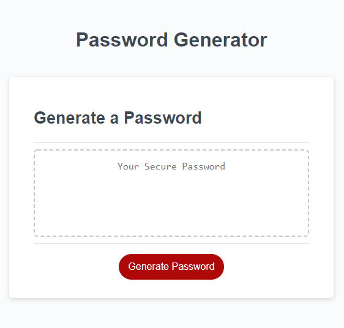

# Password Protector

## Description 

Randomized password generator that takes in a users feedback to create a secure password.

## Installation

Copy project from GitHub repo files here, https://github.com/xPuRoXdEsMaDrEx/protector-password.git, and upload them to a production server of your choice.

## Usage

This webpage is intended to help generate a random password taking in the users input preferances selected. If no characters are selected the system will default to all characters in order to generate a new password. Works with screen sized 500px and up.

Screenshot is just for referance purposes ONLY!

## Deployed Site

- https://xpuroxdesmadrex.github.io/protector-password/

## GitHub Link

- https://github.com/xPuRoXdEsMaDrEx/protector-password

## Referances

- https://www.w3schools.com/jsref/jsref_statements.asp
- https://www.w3schools.com/jsref/jsref_reference.asp
- https://www.w3schools.com/jsrEF/default.asp
- https://www.w3schools.com/jsref/jsref_function.asp
- https://www.w3schools.com/js/js_function_parameters.asp
- https://developer.mozilla.org/en-US/docs/Web/JavaScript/Reference/Functions/arguments
- https://jschallenger.com/
- Class repo & the learning assistants on AskBCS for the slack app

## License

MIT License

Copyright (c) 2022 Gabriel Rodriguez

Permission is hereby granted, free of charge, to any person obtaining a copy
of this software and associated documentation files (the "Software"), to deal
in the Software without restriction, including without limitation the rights
to use, copy, modify, merge, publish, distribute, sublicense, and/or sell
copies of the Software, and to permit persons to whom the Software is
furnished to do so, subject to the following conditions:

The above copyright notice and this permission notice shall be included in all
copies or substantial portions of the Software.

THE SOFTWARE IS PROVIDED "AS IS", WITHOUT WARRANTY OF ANY KIND, EXPRESS OR
IMPLIED, INCLUDING BUT NOT LIMITED TO THE WARRANTIES OF MERCHANTABILITY,
FITNESS FOR A PARTICULAR PURPOSE AND NONINFRINGEMENT. IN NO EVENT SHALL THE
AUTHORS OR COPYRIGHT HOLDERS BE LIABLE FOR ANY CLAIM, DAMAGES OR OTHER
LIABILITY, WHETHER IN AN ACTION OF CONTRACT, TORT OR OTHERWISE, ARISING FROM,
OUT OF OR IN CONNECTION WITH THE SOFTWARE OR THE USE OR OTHER DEALINGS IN THE
SOFTWARE.

    
